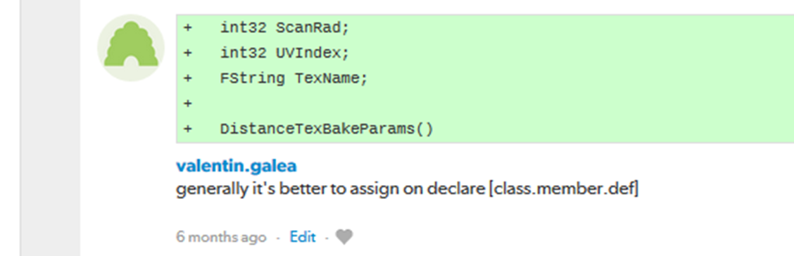
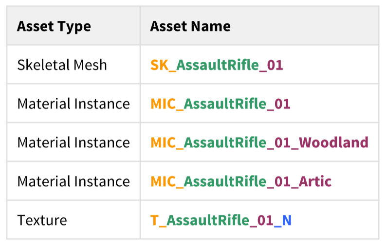
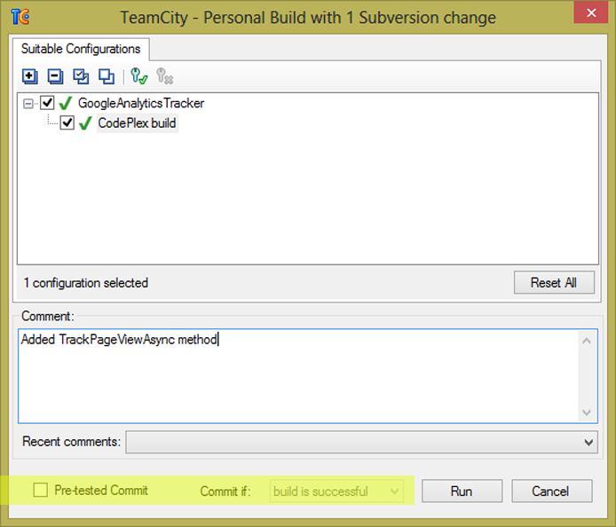
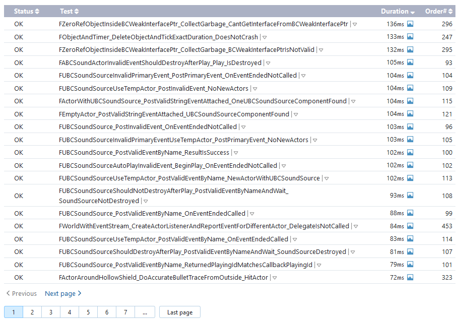

import { CodeSurfer } from "mdx-deck-code-surfer"
export { default as theme } from "./theme"
import vsDark from "prism-react-renderer/themes/vsDark"
import { Appear } from 'mdx-deck'
import { Head } from 'mdx-deck'
import { Image } from 'mdx-deck'

# UE4

<Head><title>UE4</title></Head>

TODO: proper title & backgr img
TODO: move img's to work both ways (do junction)

---
<Image src="img/timeline/sd-timeline-1.jpg" />

---
<Image src="img/timeline/sd-timeline-2.jpg" />

---
<Image src="img/timeline/sd-timeline-3.jpg" />

---
<Image src="img/UE4/Unreal-Fest-GOW-UE.jpg" />

---
<Image src="img/UE4/Unreal-Fest-GOW-4.jpg" />

---
<Image src="img/UE4/Unreal-Fest-GOW-5.jpg" />

---
<Image src="img/UE4/Unreal-Fest-GOW-T.jpg" />

---
<Image src="img/UE4/Unreal-Fest-Unannounced.jpg" />

---
## Original agenda

TODO: do properly

- Quick history of the studio
- Overview of the shipped UE games
- Internal teams and management
- Coding Standards and approach
- Content Standards and enforcing
- Engine changes
- Game architecture / modules
- Unit / Functional testing
- Approach in ECS design
- Learnings from GAS
- Tools overview
- Submit and review policies
- Build pipelines / CI
- Engine migrations and merge strategy
- Multiple project management

---
## Revised agenda

- Intro & history
- Coding & Content Standards
  * Coding std
  * Content std
  * Content validators
- Compilation / CI
  * Build machines / hardware
  * Build Graph
  * Pre-Commit
  * Triggers
- Testing infrastructure
- UGS
- Project structure
  * Module organisation
  * Various bits like the testing macro
- Tools & Tech Art tools
- Multiple Projects
- Engine updates

---
## Tasks

TODO: move at end

SYS: theme of code-surfer better contrast of dimmed code
SYS: find solution for incremental lists 
SYS: try embed code-surfer in react.js
SYS: find solution for header/footer https://github.com/kyleshevlin/react-edges
SYS: code-surfer change font size (for H1 especially)
DECK: change theme to white or bigger impact black
DECK: separate the sections with img's (badlands style) ideas: games or blurred screenshot of something u
DECK: increase margin for img's
DECK: change anchor colors
DECK: change `` colors

---
## Disclaimer

- Share our learnings
  * what worked well 👍
  * what didn't 👎
- Get inspired!

---
## Teams and Projects

- 300 employees
- Split across multiple ongoing projets
- Most projects use **Splash Engine**
  * vanilla UE4 + own modules and enhancements

---
# Coding Standards

---
## About

- Usually as standalone documentation (_pdf_, _wiki_, etc)
- People are supposed to study them
  * then apply in practice

---
## Pitfalls

- Grow big / Hard to navigate
- Get _out-of-date_ quickly
- In separate location
  * outside production source code
- Only select few modify or improve them
- Nobody has time to read documentation! 😛

---
## Splash Damage approach

- Standards are **source code files** 📑
  - you can break the build messing with the standard!
- Created and improved through code reviews
- A system for easy _reference_ and _searching_

---
## The Coding Standards

* 2 files
  * `SplashDamageCodingStandard.h`
  * `SplashDamageCodingStandard.cpp`
* Located in the main source code
  * `ue4/Game/Source/Main/...`
* Open Source
  * https://github.com/splash-damage/coding-standards

---

---
<CodeSurfer
  title="The standard"
  code={require("!raw-loader!../standards/snip/overview.h")}
  lang="cpp"
  showNumbers={false}
  theme={vsDark}
  steps={[
    { notes: "the header file" },
    { range: [ 1, 15], notes: "" },
    { lines: [4], notes: "notice the chapter tagging system" },
    { lines: [11] },
    { lines: [14] },
    { range: [15, 30] },
    { range: [30, 45] },
    { range: [45, 60] },
    { range: [61, 66] },
    { lines: [61, 63, 66] },
    { range: [82, 90] },
    { range: [92, 98] }
  ]}
/>

---
## Tagging

- Inspired by the C++ ISO standard itself
  * ex: `21.9.4  Initializer list range`
  * `access [support.initlist.range]`
- Allows easy _search_ and _reference_
- Handy in code reviews

---
## Usage

Applied via code reviews

 

---
## Usage (continued)

Takes the pressure off from feeling judgemental

 

---
## Modify and Improve

The standard itself is changed though reviews sent to the whole team

If enough up-votes the proposal gets submitted 👍

---
# Content Standards

---
## Motivation

- Poor organisation and practices for assets
  * ...compound over time
  * ...waste productivity
  * ...increase cooking and deployment times
- UE4 Editor is easy to modify to
  * improve workflows
  * enforce good practices

---
## Asset naming rules

- less confusion and improves searching & browsing
- `Prefix` and `BaseAssetName` are mandatory

---
## Example

---
## Enforcing

- Automated checker / validator
  * Editor commandlet
  * uses preset JSON list
  * matches asset type against name
- Intercept new asset creation

---
<CodeSurfer
  title="Asset naming definitions"
  code={require("!raw-loader!../flow/asset-naming.txt")}
  theme={vsDark}
  lang="yaml"
  steps={[
    { notes: "" },
    { range: [ 3, 6] },
    { range: [15, 18] },
    { range: [27, 30] },
    { range: [43, 46] }
  ]}
/>

---
## Enforcing (cont.)

---
## Blueprint Standards

- Same principles as the Coding Standard
- Live in `Game/Content/Standard/`
- We have some basic automatic validators
- Best gain for us:
  * enforcing comment nodes

---

---

---
# Content Validation

---
## Automated Validation

- CI (Continuous Integration) support
  * validation after submit
  * nightly builds
- Blueprints Validation
- Assets Validation

---
## Blueprints Validation

- Editor commandlet
- Basic checks
  * comment nodes present
  * public functions / vars must have tooltips
  * no functions / vars with default names
- Future work / ideas
  * leverage the Blueprint Compiler
  * more complex checks

---
## Assets Validation 

- Checks for bad or missing references
  * disregards *Developer*, *Test* folders
- Executed via cooking:
  * `-COOKALL -DUMPALLWARNINGS -WARNINGSASERRORS`
  * ⚠️ 
  * not viable for large projects
    * explore other possibilities
    * ex: dependency walker via Asset Registry

---
# Compilation

---
## Hardware

- Everyday work is very CPU intensive
- CPU hardware threads
  * jump from 8 to 16 substantial (2x)
  * same from 16 to 32
  * dimishing returns after
- Distributed compilation
  * _Incredibuild_ for some projects
  * we also tried _Fastbuild_
    * free but more difficult to integrate

---
## Build Farm

- Configuration / layout different per project
- Sweetspot price / performance for us 32 thread CPUs
  * Good performer: 16c/32t AMD Threadripper 1950x
- Orchestration
  * _TeamCity_ majority of projects
  * _Jenkins_ as well

---
## Infrastructure-As-Code

- In the past we used ad-hoc methods that didn't scale well
  * too tight integrated with the CI orchestrator
  * too bespoke for a project - cannot reuse
  * hard to debug locally
- Now leveraging Epic's own _BuildGraph_

---
## BuildGraph

- Alternative to traditional `BuildCookRun` automation commands
- XML based scripts

* How we use it
  * standardized and reusable set of scripts
  * unifies all calling paths
    * Visual Studio
    * Editor - Hot Reload
    * command line
    * CI systems

---
## BuildGraph (cont.)

- Additional benefits
  * easier edit in Visual Studio than batch files
  * allows build tasks parallelizing
  * easier dependencies management
- Our most complex use-cases:
  * prepare Unreal Game Sync editor binaries
  * code/data submit-dependency flagging

---
## BuildGraph (example)

WORK: get BuildAll.xml
TODO: maybe talk UBT/UAT in P4 (pre-commit for them)

---
# Pre-Commit

---
<CodeSurfer
  title="Normal Commit Flow"
  code={require("!raw-loader!../flow/submit.txt")}
  theme={vsDark}
  lang="yaml"
  steps={[
    { notes: "" },
    { range: [ 1,  5] },
    { range: [10, 15] },
    { range: [23, 28] },
    { range: [36, 41] }
  ]}
/>

---
<CodeSurfer
  title="Pre-Commit Flow"
  code={require("!raw-loader!../flow/pre-submit.txt")}
  theme={vsDark}
  lang="yaml"
  steps={[
    { notes: "" },
    { range: [ 1,  5] },
    { range: [10, 15] },
    { range: [23, 28] },
    { range: [36, 41] },
    { lines: [43, 47] },
    { range: [50, 53] },
    { range: [62, 66] },
  ]}
/>

---
## How it works

- Effectively 2 systems working together
- Frontend
  * what the devs interact with
- Backend
  * CI / build-machines

---
## Pre-Commit Frontend

- Tools that allow indirect submits to main code base
- Off-the-shelf
  * Visual Studio ReSharper Team City plugin
  * https://www.jetbrains.com/resharper/
- Internally developed
  * more project specific
  * written in C# or Python  

---
## Example: Visual Studio ReSharper

 
 
Build configurations 
to check against ---------------------------------- 
 
 
 
 
 
 
 
Options to auto-commit 
only on success -----------------------------------

---
## Pre-Commit Backend

- *Personal Build* system
  * starts CI build configuration in isolation
  * more configurations -> better coverage 😊️
  * more configurations -> stress on build farm ☹️
- Compile time-saving solution
  * rebuild all participating configuration nightly
  * incremental (non-unity) builds throughout the day
  * example:
    * _Editor_ + _Game(PC)_ + _Game(PS4)_
    * Overnight: 1.5-2h on fastest machine
    * Daily: 5-15 min per commit check

---
## Workflow & Rules

- Every commit validated against:
  * Has _title_ and _description_
  * Contains at least of _tag_ like `[Feature]` `[Bug]` `[Merge]` etc
  * Has links to _code review_ or code _buddies_
  * Time-limits to prevent commit-and-runs
- Some projects relax or constrain the rules more
  * example: check against known build-breaking patterns
    * (missing .h/.cpp pair)

---
## Validation

---
## Validation (contd.)

---
# Automation & Testing

---
## Unit Testing

- Testing plain classes and structs or single UObjects
- Enhancements to UE4's own framework
  - follow Given / When / Then structure
  - separate standards file 
  - integrated with CI (ex: TeamCity)
  - utilities
    * import private data from testable modules
    * `UWorld` setup & teardown

TODO: expand more on utilities?

---
<CodeSurfer
  title="Unit Test Example"
  code={require("!raw-loader!../flow/testing.cpp")}
  theme={vsDark}
  lang="cpp"
  steps={[
    { notes: "" },
    { range: [ 8, 10], notes: "syntactic sugar macros" },
    { range: [52, 53], notes: "test names must follow specific naming" },
    { range: [54, 58], notes: "Given..." },
    { range: [65, 67], notes: "...When..." },
    { range: [69, 72], notes: "...Then" },
    { range: [77, 79], notes: "cleanup" }
  ]}
/>

---
## Functional Testing

- Blueprint actors that we embed in bespoke levels using the editor
- Live under `Game/Content/Test/...`
- Named `FTEST_` to follow Epic's convention and for visibility
- Not network capable
  * Look into recent UE4 additions: _Gauntlet_

---
## CI Tests Integration

---
## Editor automation

- UnrealGameSync (UGS)
  * distributing Editor binaries is a more controlled manner
  * very useful for non-programmers
    * we stripped out the compilation support
  * we refactored the packaging script via BuildGraph
    * more control, adding symbols upload
- Basic automated Editor validation
  * build machine boots freshly compiled Editor
  * watches for crashes by monitoring logs

TODO: split in 2 slides
WORK: get info on editor run problems

---
# Projects Setup

---
## Game Modules

- We strive to have multiple independent modules
  * as opposed to 1 monolithic one
- Beneficial for
  * encapsulation and architecture
  * faster iteration (linkage improvement for ex)
  * support for Hot-Reload
  * re-use throughout projects

---
<CodeSurfer
  title="Game Module Layout Example"
  code={require("!raw-loader!../flow/modules.txt")}
  theme={vsDark}
  lang="yaml"
  steps={[
    { notes: "" },
    { range: [ 2, 14], notes: "Runtime module" },
    { range: [16, 26], notes: "Test module" },
    { lines: [3], notes: "UBT build file" },
    { range: [5, 8], notes: "Implementation" },
    { range: [10, 14], notes: "Interface" }
  ]}
/>

TODO: maybe add more modules examples

---
<CodeSurfer
  title="Game Module Layout Example"
  code={require("!raw-loader!../transfer/GenerateModule.cmd")}
  theme={vsDark}
  lang="bash"
  steps={[
    { notes: "" },
    { range: [ 4, 11], notes: "ASCII art!" },
    { range: [23, 28], notes: "user choices" },
    { range: [53, 58], notes: "creating folder structure" },
    { range: [105, 114], notes: "creating build file" },
    { range: [123, 128], notes: "creating build file" }
  ]}
/>

---
# Splash Engine

---
- We extract and re-use the UE work across projects into "Splash Engine"
- Consists of:
  * game-agnostic engine changes/enhacements/fixes gathered across time
  * re-usable mini-frameworks modules:
    * UI components
    * Audio thin abstractions
    * Events, Async Tasks
    * Utilities
- Majority of projects get seeded from "Splash Engine"
  * merges/integrations can happen both upstream and downstream
- Integrates latest UE4 versions

TODO: diagram of projects layout
TODO: Epic new version example integration
WORK: talk to Mark V about TA tools

---
# The End

TODO: credits & outro