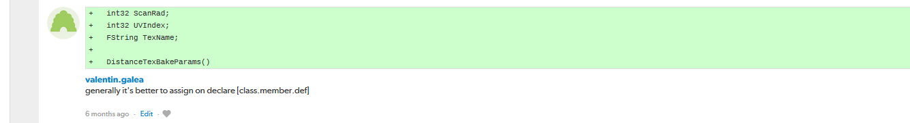
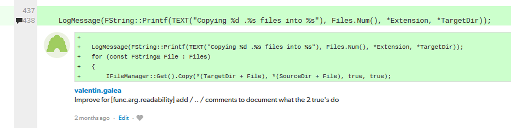
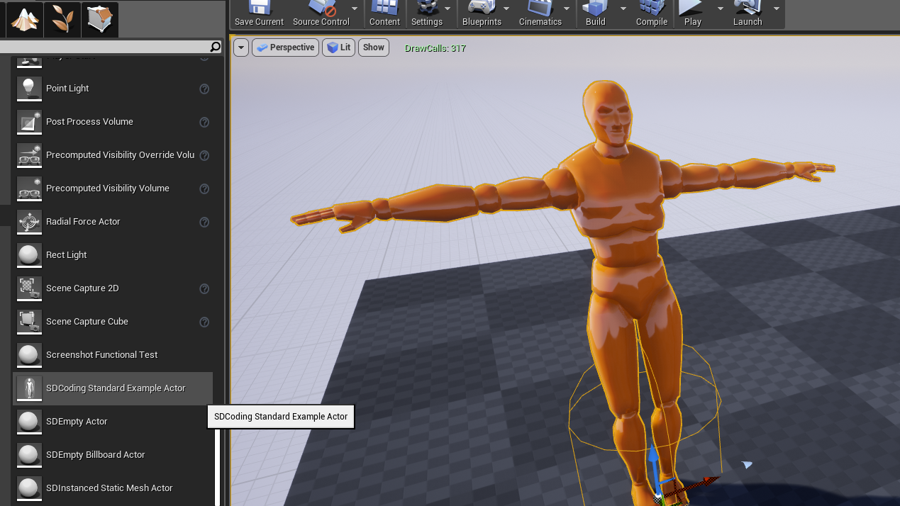

import { CodeSurfer } from "mdx-deck-code-surfer"
export { default as theme } from "./theme"
import vsDark from "prism-react-renderer/themes/vsDark"
import { Appear } from 'mdx-deck'
import { Head } from 'mdx-deck'

# Live Coding Standards

<Head><title>Live Coding Standards</title></Head>

---
import { Image } from 'mdx-deck'
import Box from 'superbox'

<Image src="img/banner.jpg">
<Box
  css={{
    position: 'relative',
    top: '50%',
    transform: 'translateY(-50%)',
    color: 'white'
  }}
>
  
VALENTIN GALEA

  [@valentin_galea](https://twitter.com/valentin_galea)

  
</Box>

</Image>

---
## What are Coding Standards

"Coding conventions are a set of guidelines for a specific programming language that recommend programming style, practices, and methods for each aspect of a program written in that language" [Wikipedia]

Formally adopted coding conventions become _standards_

---
## Examples in the wild

- C++ ISO standard promotes a specific style for naming
  - ex: all `std::` types/functions are named_like_this
- C++ Code Guidelines
  - http://isocpp.github.io/CppCoreGuidelines/CppCoreGuidelines
- Google style guide
  - https://google.github.io/styleguide/cppguide.html
- Unreal Engine 4
  - https://docs.unrealengine.com/en-us/Programming/Development/CodingStandard

---
## Enforcing / Adoption

- Normally presented as standalone documentation (PDF, wiki, etc)
- People are supposed to study them the apply in practice
- Usually not machine readable
  - one exception: Microsoft Visual Studio Code Guidelines checker

---
## Pitfalls

- They will get too big
- They get out-of-date very quickly
- In separate location / repository from production source code
- Only select few modify or improve them
- Nobody has time to read documentation! :)

---
## Splash Damage approach

- Standards are source code files!
  - you can break the build messing with the standard :)
- They are created and improved through code reviews
- A system for easy reference and searching

---
## The Coding Standards

* 2 files
  * `SplashDamageCodingStandard.h`
  * `SplashDamageCodingStandard.cpp`
* Located in the main source code
  * `ue4/Game/Source/Main/...`

---
<CodeSurfer
  title="The standard"
  code={require("!raw-loader!../standards/snip/overview.h")}
  lang="cpp"
  showNumbers={false}
  theme={vsDark}
  steps={[
    { notes: "the header file" },
    { range: [ 1, 15], notes: "" },
    { range: [15, 30] },
    { range: [30, 45] },
    { range: [45, 60] },
    { range: [60, 75] },
    { lines: [66], notes: "notice the chapter tagging system" }
  ]}
/>

---
## Tagging

- Inspired by the C++ ISO standard itself
  - ex: `21.9.4  Initializer list range access [support.initlist.range]`
- Allows easy _search_ and _reference_
- Handy in code reviews

---
## Usage

Applied via code reviews

 

---
## Usage (continued)

Takes the pressure off from feeling judgemental

 

---
## Modify and Improve

The standard itself is changed though reviews sent to the whole team

If enough up-votes the proposal gets submitted 👍

---
## Sections Walkthrough

- More architectural than strict rule-sets
- Very **Unreal Engine 4** focused
- Must cater to all experience levels

---
<CodeSurfer
  title="Section: Layout"
  code={require("!raw-loader!../standards/snip/layout.cpp")}
  lang="cpp"
  theme={vsDark}
  steps={[
    { notes: " " },
  ]}
/>

---
<CodeSurfer
  title="Section: Braces"
  code={require("!raw-loader!../standards/snip/braces.cpp")}
  lang="cpp"
  theme={vsDark}
  steps={[
    { notes: " " },
    { range: [ 8, 24], notes: "" },
    { range: [34, 47] }
  ]}
/>

---
<CodeSurfer
  title="Section: auto"
  code={require("!raw-loader!../standards/snip/auto.cpp")}
  lang="cpp"
  theme={vsDark}
  steps={[
    { notes: " " },
    { range: [ 6, 12], notes: "" },
    { range: [17, 19] },
    { range: [21, 27] },
    { range: [29, 40] },
    { range: [46, 53] }
  ]}
/>

---
<CodeSurfer
  title="Section: lambda"
  code={require("!raw-loader!../standards/snip/lambda.cpp")}
  lang="cpp"
  theme={vsDark}
  steps={[
    { notes: " " },
    { range: [ 3,  8], notes: "" },
    { range: [17, 22] },
    { range: [24, 28] },
    { range: [34, 43] }
  ]}
/>

---
## Unintended consequences

<Appear>
  
</Appear>

---
## The End

[@valentin_galea](https://twitter.com/valentin_galea)

  

https://www.splashdamage.com/
